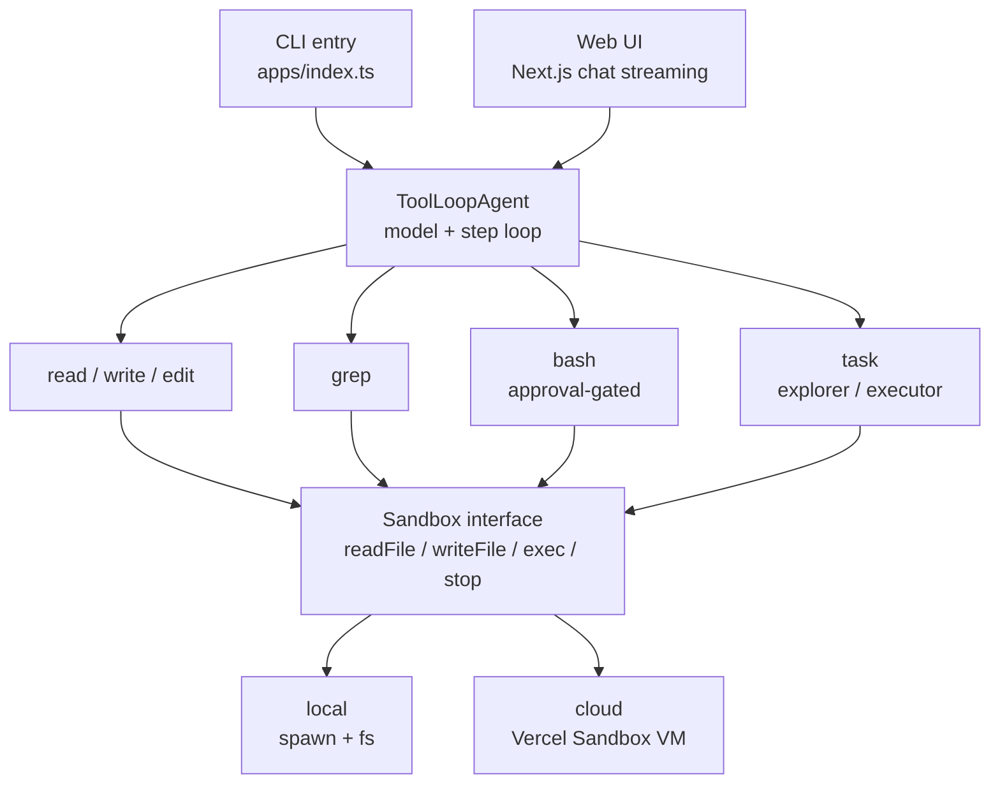
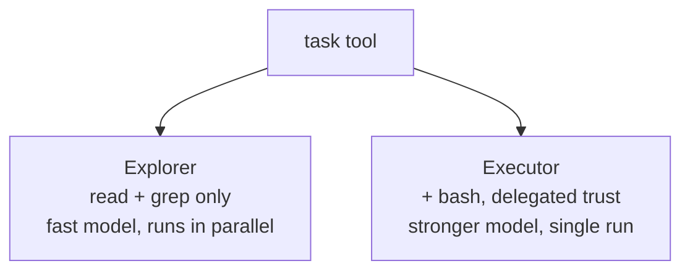
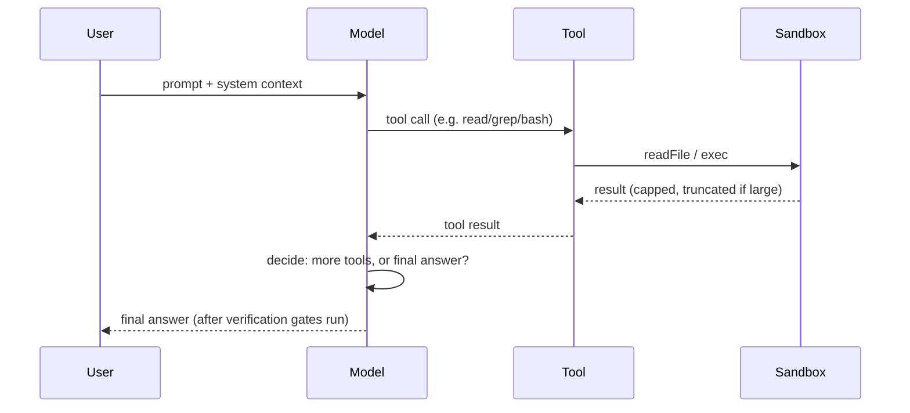

# Craftly

A TypeScript coding-agent harness built on the [Vercel AI SDK](https://sdk.vercel.ai) `ToolLoopAgent`. Give it a natural-language prompt; it decides which tools to call, executes them against a sandboxed filesystem/shell, and reports back — with role-scoped subagents, approval gating, context management, chaos testing, an eval suite, and a streaming web UI.

---

## Table of contents

- [Overview](#overview)
- [Architecture](#architecture)
- [Project structure](#project-structure)
- [Packages](#packages)
- [Tools](#tools)
- [Subagents: explorer & executor](#subagents-explorer--executor)
- [Sandbox backends](#sandbox-backends)
- [Approval & safety](#approval--safety)
- [Context management](#context-management)
- [Verification gates](#verification-gates)
- [Eval framework](#eval-framework)
- [Web UI](#web-ui)
- [Getting started](#getting-started)
- [Environment variables](#environment-variables)
- [Roadmap](#roadmap)

---


## Overview


| Layer      | Package                 | Role                                                                                           |
| ---------- | ----------------------- | ---------------------------------------------------------------------------------------------- |
| Entry      | `apps/index.ts`, `web/` | CLI (terminal) and Next.js web UI, both call into `packages/cli`                               |
| Agent loop | `ai` (`ToolLoopAgent`)  | Model thinks, calls tools, repeats until done (max steps configurable)                         |
| Tools      | `packages/tools`        | `read`, `write`, `edit`, `grep`, `bash`, `task`, `todo`, `askUser`                             |
| Sandbox    | `packages/sandbox`      | Local (`spawn` + `fs`) or cloud (Vercel Sandbox VM), plus chaos-mode fault injection           |
| Core       | `packages/core`         | Sandbox interface, approval policy, verification-gate discovery, system prompt, prompt caching |
| Eval       | `eval/`                 | 15-case behavioral test suite with F1/safety/judge scoring against fixture projects            |


## Architecture




### Subagent delegation (`task` tool)




The parent agent can fan out several **explorer** subagents in parallel for read-only research (each gets its own cheap/fast model instance), or hand off a single well-scoped implementation task to an **executor** subagent that gets its own delegated-trust `bash` grant and a stronger model — separate from the parent's interactive approval policy.

### Request lifecycle




---


## Project structure

```
Coding-Agent-Harness/
├── Architecture.md          # living architecture doc
├── IMPLEMENTATION_GUIDE.md  # module-by-module build notes
├── AGENTS.md                # project-specific agent instructions
├── docs/
│   └── roadmap.md           # detailed Craftly roadmap / production gaps
├── apps/
│   └── index.ts             # thin CLI entry -> @coding-agent-harness/cli
├── packages/
│   ├── core/                # sandbox interface, approval, verification, system prompt, cache
│   ├── sandbox/             # local / cloud backends, chaos mode, lifecycle hooks
│   ├── tools/                # tool factories: read, write, edit, grep, bash, task, todo, askUser
│   └── cli/                  # main(), createSandbox, agent wiring, CLI trace output
├── eval/                     # behavioral eval suite (15 test cases)
│   ├── src/                  # runner, scoring (F1, safety, judge), reporting
│   ├── test-cases/           # TC-001 … TC-015 (YAML)
│   └── fixtures/             # tiny fixture projects the agent runs against
└── web/                      # Next.js chat UI with streaming
    └── app/api/chat/         # chat / session / stream API routes
```


## Packages


| Package                         | Exports                                                                                                                                            | Notes                                                                |
| ------------------------------- | -------------------------------------------------------------------------------------------------------------------------------------------------- | -------------------------------------------------------------------- |
| `@coding-agent-harness/core`    | `Sandbox` interface, `createApproval`, `discoverGates`, `buildSystemPrompt`, `addCacheControl`, `openaiCacheProviderOptions`                       | Shared contracts and cross-cutting concerns                          |
| `@coding-agent-harness/sandbox` | `sandbox-local`, `sandbox-cloud`, `wrapWithChaos`, lifecycle hooks                                                                                 | Concrete `Sandbox` implementations                                   |
| `@coding-agent-harness/tools`   | `createReadTool`, `createWriteTool`, `createEditTool`, `createGrepTool`, `createBashTool`, `createTaskTool`, `createTodoTool`, `createAskUserTool` | Tool factories, dependency-injected with a `Sandbox`                 |
| `@coding-agent-harness/cli`     | `main()`                                                                                                                                           | Wires sandbox + tools + agent, guarantees shutdown via `try/finally` |
| `@coding-agent-harness/eval`    | eval runner                                                                                                                                        | Runs the real agent against fixtures and scores the result           |


### Design patterns in use


| Pattern                  | Where                                                                                |
| ------------------------ | ------------------------------------------------------------------------------------ |
| **Strategy**             | `Sandbox` interface with interchangeable local/cloud backends                        |
| **Factory**              | `createSandbox`, `createReadTool`, `createApproval`, etc.                            |
| **Adapter**              | `sandbox-cloud.ts` wraps `@vercel/sandbox`'s VM API                                  |
| **Dependency injection** | Every tool factory takes `sandbox` (and sometimes an approval policy) as a parameter |
| **Lifecycle hooks**      | `afterStart` / `beforeStop` / `onTimeout` on `SandboxLifecycleHooks`                 |
| **Discriminated union**  | `ApprovalConfig`: `interactive` | `background` | `delegated`                         |
| **Decorator**            | `wrapWithChaos(sandbox, mode)` wraps any `Sandbox` to inject one fault per session   |


---


## Tools


| Tool      | Backing call             | Purpose                                                            | Caps                    |
| --------- | ------------------------ | ------------------------------------------------------------------ | ----------------------- |
| `read`    | `readFile`               | Numbered file contents, paginated                                  | 500 lines               |
| `write`   | `writeFile`              | Full overwrite / new file                                          | —                       |
| `edit`    | `readFile` + `writeFile` | Exact-string replace; fails if the match isn't unique              | —                       |
| `grep`    | `exec` (`grep -rn`)      | Regex search across files                                          | 50 matches              |
| `bash`    | `exec`                   | Shell commands, gated by approval policy                           | 5,000 chars (tail kept) |
| `task`    | subagent `generate()`    | Delegates to an explorer or executor subagent                      | step-limited per role   |
| `todo`    | in-memory                | Multi-step task list, single `in_progress` constraint              | —                       |
| `askUser` | —                        | Forces a multiple-choice question instead of guessing on ambiguity | 2–4 options             |


`edit` is deliberately unforgiving: 0 matches or 2+ matches both fail with a message telling the model to narrow the string or use `write` instead, rather than silently guessing which occurrence was meant.

## Subagents: explorer & executor

The `task` tool implements a planner/worker split, not just a stub:

- **Explorer** — read-only (`read` + `grep`), runs on a fast/cheap model (`OPENAI_EXPLORER_MODEL`), and multiple explorer descriptions run **in parallel** (`Promise.all`) for independent research threads.
- **Executor** — gets `read`, `grep`, and a **delegated-trust** `bash` (its own approval policy, distinct from the parent's interactive one), runs on a stronger model (`OPENAI_EXECUTOR_MODEL`), and is restricted to exactly one description — parallel executors aren't supported, since concurrent writes to the same working directory are unsafe.


## Sandbox backends


|             | Local                          | Cloud                                                    |
| ----------- | ------------------------------ | -------------------------------------------------------- |
| Cost        | Free                           | Per-minute                                               |
| Latency     | Microseconds                   | Network round-trip per call                              |
| Isolation   | None (raw `spawn` on the host) | Full remote VM (`@vercel/sandbox`)                       |
| Persistence | Permanent                      | Until timeout or snapshot                                |
| Seeding     | N/A (already on disk)          | `afterStart` hook: git clone, `writeFiles`, install deps |
| Restore     | —                              | `VERCEL_SNAPSHOT_ID` → snapshot restore                  |


**Chaos mode** (`CHAOS=1` or `--chaos`) injects one random failure per session to test resilience: `kill-mid-command` (exit 137), `stale-handle` (garbage output), `state-divergence`, and `skip-status` (stale status cache).

## Approval & safety

`bash` is gated through `createApproval`, a discriminated union of three modes:

- `interactive` — safe prefixes (`ls`, `git status`, …) pass; everything else is blocked with a message the model must report honestly (it cannot ask the user to override).
- `background` — everything blocked.
- `delegated` — an explicit trust list of allowed command prefixes (used by the executor subagent).

This is a **config-layer** policy (who decides, for this session) — an **event-layer** policy (what's blocked regardless of mode, e.g. writes to `.env`) is called out in `Architecture.md` as planned but not yet implemented.

## Context management

Every agent step re-sends the full message history by default, so input tokens grow linearly unless managed:

1. **Measure** — `onStepFinish` logs input/output tokens per step to stderr.
2. **Prune** — `prepareCall` strips tool call/result pairs older than the last 3 messages before every model call.
3. **Cap tool output** — `read` (500 lines), `grep` (50 matches), `bash` (5,000 chars, tail kept) so no single result floods context.
4. **Cache** — `addCacheControl` marks stable message prefixes for Anthropic; `openaiCacheProviderOptions` sets `promptCacheKey`/`promptCacheRetention` for OpenAI.


## Verification gates

Before reporting done, the agent discovers real verification commands from the target project's `package.json` (`discoverGates`): `typecheck`/`type-check` scripts (or `npx tsc --noEmit` if TypeScript is a dependency but no script exists), `lint`, `test`, `build` — using the right package manager (`pnpm`/`npm`). The system prompt requires the model to actually run these and report pass/fail honestly, distinguishing failures it caused from pre-existing ones.

## Eval framework

`eval/` runs the **real agent** (not a mock) against tiny fixture projects and scores the result — this isn't a placeholder.

- **15 test cases** (`TC-001`–`TC-015`) across categories: routing, safety gates, context management, verification honesty, ambiguity handling, planning, delegation.
- **Scoring**: F1 against expected tool usage, safety-violation checks, tool-order checks, an optional LLM-judge threshold — see `eval/METRICS.md`.
- **Modes**: `pnpm eval:dry` (list only), `pnpm eval` (scorecard — exits 0 unless a safety violation or crash), `pnpm eval -- --strict` (CI gate: fail if pass rate < 0.75).
- Results append to `eval/results/runs.jsonl` (gitignored).


## Web UI

A Next.js app (`web/`) providing a browser chat interface over the same agent, with:

- `web/app/api/chat/route.ts` — chat endpoint
- `web/app/api/chat/session/` — session handling
- `web/app/api/chat/stream/` — streamed responses to the browser

This is the newest addition (added the same day as the CLI streaming option) and isn't yet reflected in `Architecture.md`.

---


## Getting started

```bash
git clone https://github.com/sagnik26/Coding-Agent-Harness.git
cd Coding-Agent-Harness
pnpm install
cp .env.example .env   # fill in OPENAI_API_KEY at minimum

pnpm start . "Read the tsconfig.json"     # run the CLI agent
pnpm web                                   # run the web UI (Next.js dev server)
pnpm eval:dry                              # list eval cases without calling the API
pnpm eval                                  # run the eval suite
pnpm typecheck                             # workspace-wide typecheck
```


## Environment variables


| Variable                                                    | Purpose                                                                     | Default                              |
| ----------------------------------------------------------- | --------------------------------------------------------------------------- | ------------------------------------ |
| `OPENAI_API_KEY`                                            | Required — OpenAI auth                                                      | —                                    |
| `OPENAI_MODEL`                                              | Default agent model                                                         | `gpt-4o-mini`                        |
| `OPENAI_EXPLORER_MODEL`                                     | Model for explorer subagents                                                | falls back to `OPENAI_MODEL`         |
| `OPENAI_EXECUTOR_MODEL`                                     | Model for executor subagent                                                 | falls back to `OPENAI_MODEL`         |
| `OPENAI_PROMPT_CACHE_KEY` / `OPENAI_PROMPT_CACHE_RETENTION` | Prompt-cache tuning                                                         | `coding-agent-harness` / `in_memory` |
| `SANDBOX`                                                   | `local` or `cloud`                                                          | `local`                              |
| `CLOUD_GIT_URL` / `CLOUD_GIT_REVISION`                      | Repo to clone into the cloud VM                                             | —                                    |
| `VERCEL_SNAPSHOT_ID`                                        | Restore cloud sandbox from a snapshot                                       | —                                    |
| `VERCEL_OIDC_TOKEN`                                         | Vercel auth for cloud sandbox (local dev: `vercel link && vercel env pull`) | —                                    |
| `CHAOS` / `CHAOS_MODE`                                      | Enable chaos-mode fault injection                                           | off                                  |


---


## Roadmap

Upcoming focus areas:

- [ ] Stronger local sandbox isolation and filesystem guardrails
- [ ] Event-layer approval policy, audit logging, and session cost ceilings
- [ ] Durable sessions, interrupt resume, and multi-turn web persistence
- [ ] Auth, multi-tenant isolation, and usage metering
- [ ] Multi-provider routing, fallbacks, and cost-aware model selection
- [ ] Structured tracing, spend reporting, and session replay
- [ ] Richer tools (multi-file patches, search/browse, git-native flows)
- [ ] CI-wired evals, broader benchmarks, and cloud soak tests
- [ ] Cloud `onTimeout` snapshots and provider failover

For detailed information, see [docs/roadmap.md](docs/roadmap.md).